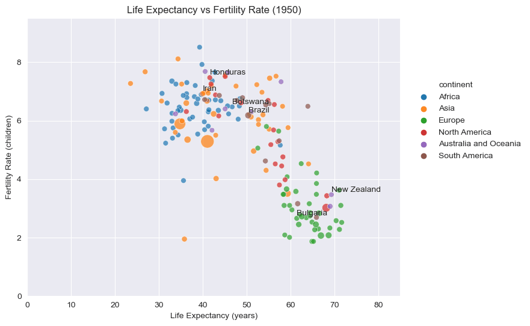

# Gapminder Project
 This project involves the analysis and visualization of global population, fertility rate, and life expectancy data from various continents and countries over the years. In this project, we use Python with libraries such as pandas, numpy, matplotlib, seaborn, and imageio to analyze, visualize, and generate insights from the data.

## Overview
 The Project focuses on exploring and understanding trends in global population, fertility rate, and life expectancy data. The main steps of the project are as follows:

1. Importing Libraries: Import necessary libraries for data analysis, data visualization, and image processing.

2. Data Loading and Inspection: Load the required datasets and inspect their basic properties such as column names, data types, and missing values.

3. Data Cleaning and Preprocessing: Clean and preprocess the data by handling missing values, renaming columns, and dropping unnecessary columns.

4. Exploratory Data Analysis (EDA): Perform exploratory data analysis to gain insights into the data. This includes creating histograms, bar plots, and summary statistics to understand the distribution and trends.

5. Data Merging: Merge multiple dataframes to create a comprehensive dataset that includes information on continents, population, fertility rate, and life expectancy.

6. Data Visualization: Create various types of visualizations, including box plots, bar plots, scatter plots, and more, to visualize relationships and trends between different variables.

7. Animated Visualizations: Generate animated GIFs to visualize changes in life expectancy, fertility rate, and population over the years for different continents.

## Getting Started
Follow these steps:

1. Clone the Repository: Clone this GitHub repository to your local machine.

2. Install Dependencies: Ensure you have the required Python libraries installed. You can install them using the following command:

``````
pip install pandas numpy matplotlib seaborn imageio
``````

* For Jupyter notebooks : 

``````
!pip install pandas numpy matplotlib seaborn imageio
``````

3. Data Files: The data are provided in the data folder and they include three csv and one xls file.


4. Run the Code 

5. While running the code new csv files will be created in the data folder, as well as images and GIFs in the respective folders.


Directory Structure :
``````
- data/             # Directory to store data files
- images/           # Directory to store individual plot images
- gifs/             # Directory to store generated animated GIFs
- README.md         # Project documentation (you are here)
- main_code.py      # Main Python script containing the project code
``````

## Project Output
The project generates various visualizations that offer insights into global population, fertility rate, and life expectancy trends. These visualizations include histograms, bar plots, scatter plots, and animated GIFs. Additionally, the project calculates summary statistics and analyzes the relationships between different variables.


## Visualization Example:




